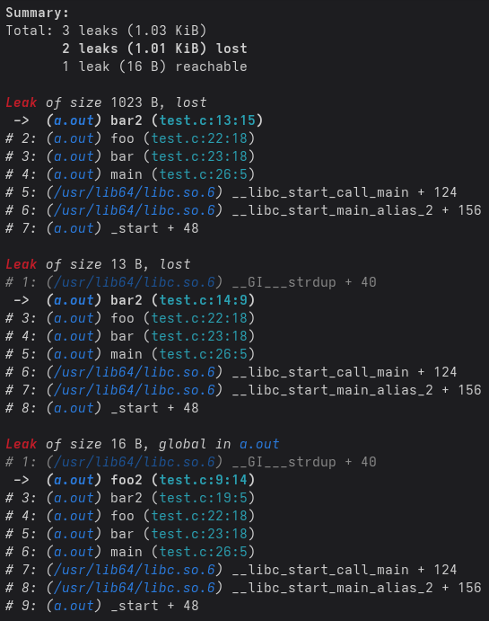

# LeakSanitizer
Tool to track down memory leaks.

It can be used in conjunction with code written in almost any programming language that compiles down to native machine
code.  
Officially supported languages are currently:
- C
- C++
- Objective-C
- Swift

This tool is available for both **Linux** and **macOS**.

## Usage
### Installation
Get started by [downloading a release][1].  
Simply move the headers and the library anywhere you like.

Alternatively, you can build the LeakSanitizer from source:
```shell
git clone --recurse-submodules https://github.com/mhahnFr/LeakSanitizer.git && cd LeakSanitizer && make
```
It is automatically installed in the directory where the LeakSanitizer was cloned in. To install it in a specific
directory, use the following command:
```shell
make INSTALL_PATH=/usr/local install
```
Adapt the value of the `INSTALL_PATH` argument to your needs.

> [!TIP]
> To create a portable build (just like a downloaded release), use the following command:
> ```shell
> make release
> ```

#### Build dependencies
The LeakSanitizer adheres to the standard of C++23.

Additionally, the following command line tools are necessary to successfully build the LeakSanitizer:
- GNU compatible `make` command line tool
- The `cat` command line tool *(POSIX.2)*

All [dependencies introduced by the CallstackLibrary][2] are needed as well.

### Uninstallation
To uninstall the LeakSanitizer, simply remove its headers and its library from the installation directory.  
This can be done by the following command:
```shell
make INSTALL_PATH=/usr/local uninstall
```
Adapt the value of the `INSTALL_PATH` argument to your needs.

### Usage, take II
Use this tool by preloading its runtime library or by linking against it *(recommended)*.

#### Linking *(recommended)*
Add the runtime library of the LeakSanitizer to your linking arguments.

> [!TIP]
> **Example** for standard C/C++ compilers:
> ```shell
> -L<path/to/LeakSanitizer> -llsan
> ```

#### Preloading
Add the runtime library to the preload environment variable of your dynamic linker:
- **Linux**:
```shell
LD_PRELOAD=<path/to/LeakSanitizer>/liblsan.so
```
- **macOS**:
```shell
DYLD_INSERT_LIBRARIES=<path/to/LeakSanitizer>/liblsan.dylib
```

### Leak detection
Once this sanitizer is bundled with your application the detected memory leaks are printed upon termination.

**Example**:
```C
// test.c

#include <string.h>
#include <stdlib.h>

char* global;

void foo2(void) {
    global = strdup("Global variable");
}

void bar2(void) {
    void* a = malloc(1023);
    a = strdup("Hello World!");
    a = NULL;
    a = malloc(1000);
    free(a);
    
    foo2();
}

void foo(void) { bar2(); }
void bar(void) { foo();  }

int main(void) {
    bar();
}
```
Compiled and linked on **macOS** with the command
```shell
cc -g test.c -L<path/to/LeakSanitizer> -llsan
```
this example creates the following output:
<picture>
    <source srcset="documentation/images/light/leak-example.png" media="(prefers-color-scheme: light), (prefers-color-scheme: no-preference)" />
    <source srcset="documentation/images/dark/leak-example.png" media="(prefers-color-scheme: dark)" />
    
</picture>

Compiled and linked on **Fedora** with the command
```shell
gcc -g test.c -L<path/to/LeakSanitizer> -llsan
```
the example above creates the following output:
<picture>
    <source srcset="documentation/images/light/leak-example-fedora.png" media="(prefers-color-scheme: light), (prefers-color-scheme: no-preference)" />
    <source srcset="documentation/images/dark/leak-example-fedora.png" media="(prefers-color-scheme: dark)" />
    
</picture>

> [!TIP]
> Indirect memory leaks can be displayed by setting [`LSAN_INDIRECT_LEAKS`][b11] to `true`:
> ```shell
> LSAN_INDIRECT_LEAKS=true
> ```
> 
> Reachable memory leaks (those to which a pointer was found) can be hidden by setting [`LSAN_REACHABLE_LEAKS`][b12] to
> `false`:
> ```shell
> LSAN_REACHABLE_LEAKS=false
> ```

#### Source file line numbers
To add source file line information to the output (as shown above), simply compile your target with debug symbols.
> [!TIP]
> Usually, the appropriate compilation option is `-g`.

Currently, debug symbols in the following formats are supported:
- DWARF in ELF binary files
- DWARF in Mach-O debug maps (using Mach-O object files)
- `.dSYM` Mach-O bundles

The DWARF parser supports DWARF in version **2**, **3**, **4** and **5**.

### Behaviour
Since version 1.6 the behaviour of this sanitizer can be adjusted by setting certain environment variables.  
The following variables are currently supported:

| Name                               | Description                                                 | Since | Type                 | Default value |
|------------------------------------|-------------------------------------------------------------|-------|----------------------|---------------|
| [`LSAN_HUMAN_PRINT`][b1]           | Print human-readably formatted                              | v1.6  | [Boolean][b15]       | `true`        |
| [`LSAN_PRINT_COUT`][b2]            | Print to the default output stream                          | v1.6  | [Boolean][b15]       | `false`       |
| [`LSAN_PRINT_FORMATTED`][b3]       | Print using ANSI escape codes                               | v1.6  | [Boolean][b15]       | `true`        |
| [`LSAN_INVALID_CRASH`][b4]         | Terminate if an invalid action is detected                  | v1.6  | [Boolean][b15]       | `true`        |
| [`LSAN_INVALID_FREE`][b5]          | Detect invalid deallocations                                | v1.6  | [Boolean][b15]       | `true`        |
| [`LSAN_FREE_NULL`][b6]             | Issue a warning if `NULL` is `free`d                        | v1.6  | [Boolean][b15]       | `false`       |
| [`LSAN_STATS_ACTIVE`][b7]          | Enable the statistical bookkeeping                          | v1.6  | [Boolean][b15]       | `false`       |
| [`LSAN_CALLSTACK_SIZE`][b8]        | The amount of frames to be printed in a callstack           | v1.6  | Number               | `20`          |
| [`LSAN_PRINT_EXIT_POINT`][b9]      | Print the callstack of the exit point                       | v1.7  | [Boolean][b15]       | `false`       |
| [`LSAN_PRINT_BINARIES`][ba]        | Print the binary file names                                 | v1.8  | [Boolean][b15]       | `true`        |
| [`LSAN_PRINT_FUNCTIONS`][bb]       | Always print the function names                             | v1.8  | [Boolean][b15]       | `true`        |
| [`LSAN_RELATIVE_PATHS`][bc]        | Allow relative paths to be printed                          | v1.8  | [Boolean][b15]       | `true`        |
| [`LSAN_ZERO_ALLOCATION`][bd]       | Issue a warning when `0` byte are allocated                 | v1.8  | [Boolean][b15]       | `false`       |
| [`LSAN_AUTO_STATS`][be]            | Time interval between the automatically statistics printing | v1.11 | [Time interval][b16] | *None*        |
| [`LSAN_SUPPRESSION_DEVELOPER`][bf] | Activates more suppression developer output                 | v1.11 | [Boolean][b15]       | `false`       |
| [`LSAN_INDIRECT_LEAKS`][b11]       | Whether to print indirectly leaked allocations              | v1.11 | [Boolean][b15]       | `false`       |
| [`LSAN_REACHABLE_LEAKS`][b12]      | Whether to print leaks to whose a pointer was found         | v1.11 | [Boolean][b15]       | `true`        |
| [`LSAN_SUPPRESSION_FILES`][b13]    | List of additional suppression files to be considered       | v1.11 | [File list][b17]     | *None*        |
| [`LSAN_SYSTEM_LIBRARY_FILES`][b14] | List of additional system library files to be considered    | v1.11 | [File list][b17]     | *None*        |

> [!TIP]
> [`LSAN_AUTO_STATS`][be] should be assigned a number with a time unit directly after the number.  
> The following time units are available:
> - `ns`: nanoseconds
> - `us`: microseconds
> - `ms`: milliseconds
> - `s`: seconds
> - `m`: minutes
> - `h`: hours
>
> The default unit when none is given is seconds.

More on the environment variables [here][3].

### Leak suppression system
Use the memory leak suppression system introduced in version **1.11** to "remove" internal memory leaks created by the
runtime libraries you additionally use.

Add your additional suppression files to the environment variable [`LSAN_SUPPRESSION_FILES`][b13].
> [!TIP]
> **Example**:
> ```shell
> LSAN_SUPPRESSION_FILES='someLibrarySuppressions.json:otherIgnoredLeaks.json'
> ```

Follow the [full documentation of the suppression system][10] in order to write your own suppression files.

### Signals
This sanitizer comes with handlers for the following signals:

| Signal            | Action                                                                                       |
|-------------------|----------------------------------------------------------------------------------------------|
| `SIGUSR1`         | Prints the statistics if enabled using [`LSAN_STATS_ACTIVE`][b7] or [`LSAN_AUTO_STATS`][be]. |
| `SIGUSR2`         | Prints the current callstack.                                                                |
| Any deadly signal | is caught and the stacktrace of the cash is printed.                                         |

More about the signal handlers [here][4].

### Statistics
The statistics of the tracked memory can be queried at runtime. To do so activate the statistical bookkeeping by either
setting the environment variable [`LSAN_STATS_ACTIVE`][b7] to `true` or by using [`LSAN_AUTO_STATS`][be].  
The statistics then can be queried using the following API:

| Function                               | Description                                                                                    |
|----------------------------------------|------------------------------------------------------------------------------------------------|
| [`__lsan_getTotalMallocs()`][s1]       | Returns the total count of allocations registered.                                             |
| [`__lsan_getTotalBytes()`][s2]         | Returns the total count of allocated bytes.                                                    |
| [`__lsan_getTotalFrees()`][s3]         | Returns the total count of registered allocations that have been deallocated.                  |
| [`__lsan_getCurrentMallocCount()`][s4] | Returns the count of currently active allocations.                                             |
| [`__lsan_getCurrentByteCount()`][s5]   | Returns the amount of currently allocated bytes.                                               |
| [`__lsan_getMallocPeek()`][s6]         | Returns the highest amount of allocations at the same time.                                    |
| [`__lsan_getBytePeek()`][s7]           | Returns the highest amount of bytes allocated at the same time.                                |
| [`__lsan_printStats()`][s8]            | Prints the statistics to the output stream specified by [`LSAN_PRINT_COUT`][b2].               |
| [`__lsan_printFStats()`][s9]           | Prints the fragmentation statistics to the output stream specified by [`LSAN_PRINT_COUT`][b2]. |

More on the statistics [here][5].

## Behind the scenes or: How does it work?
In order to track the memory allocations this sanitizer replaces the common allocation management functions such as
`malloc`, `calloc`, `realloc` and `free`. Every allocation and deallocation is registered and a stacktrace is created
for it.  
The allocations created by the LeakSanitizer are ignored.

The signal handlers and the wrapper functions are installed once the sanitizer has been loaded by the dynamic linker.

When the exit handler registered using `atexit` is invoked the allocated memory is examined and the detected memory
leaks are printed.  
The stacktraces are managed using the [CallstackLibrary][6].

## Final notes
If you experience any problems with the LeakSanitizer or if you have ideas to further improve it do not hesitate to
[open an issue][7] or to [open a pull request][8].

This project is licensed under the terms of the GNU GPL in version 3 or later.

© Copyright 2022 - 2025 [mhahnFr][9] and contributors

 [1]: https://github.com/mhahnFr/LeakSanitizer/releases/latest
 [2]: https://github.com/mhahnFr/CallstackLibrary/blob/main/README.md#build-dependencies
 [3]: documentation/Behaviour.md
 [4]: documentation/Signal-handlers.md
 [5]: https://github.com/mhahnFr/LeakSanitizer/wiki/Home#Statistics
 [6]: https://github.com/mhahnFr/CallstackLibrary
 [7]: https://github.com/mhahnFr/LeakSanitizer/issues/new
 [8]: https://github.com/mhahnFr/LeakSanitizer/pulls
 [9]: https://github.com/mhahnFr
[10]: documentation/Suppressions.md

[s1]: https://github.com/mhahnFr/LeakSanitizer/wiki/lsan_stats.h#size_t-__lsan_gettotalmallocs
[s2]: https://github.com/mhahnFr/LeakSanitizer/wiki/lsan_stats.h#size_t-__lsan_gettotalbytes
[s3]: https://github.com/mhahnFr/LeakSanitizer/wiki/lsan_stats.h#size_t-__lsan_gettotalfrees
[s4]: https://github.com/mhahnFr/LeakSanitizer/wiki/lsan_stats.h#size_t-__lsan_getcurrentmalloccount
[s5]: https://github.com/mhahnFr/LeakSanitizer/wiki/lsan_stats.h#size_t-__lsan_getcurrentbytecount
[s6]: https://github.com/mhahnFr/LeakSanitizer/wiki/lsan_stats.h#size_t-__lsan_getmallocpeek
[s7]: https://github.com/mhahnFr/LeakSanitizer/wiki/lsan_stats.h#size_t-__lsan_getbytepeek
[s8]: https://github.com/mhahnFr/LeakSanitizer/wiki/lsan_stats.h#void-__lsan_printstats
[s9]: https://github.com/mhahnFr/LeakSanitizer/wiki/lsan_stats.h#void-__lsan_printfstats

 [b1]: documentation/Behaviour.md#lsan_human_print
 [b2]: documentation/Behaviour.md#lsan_print_cout
 [b3]: documentation/Behaviour.md#lsan_print_formatted
 [b4]: documentation/Behaviour.md#lsan_invalid_crash
 [b5]: documentation/Behaviour.md#lsan_invalid_free
 [b6]: documentation/Behaviour.md#lsan_free_null
 [b7]: documentation/Behaviour.md#lsan_stats_active
 [b8]: documentation/Behaviour.md#lsan_callstack_size
 [b9]: documentation/Behaviour.md#lsan_print_exit_point
 [ba]: documentation/Behaviour.md#lsan_print_binaries
 [bb]: documentation/Behaviour.md#lsan_print_functions
 [bc]: documentation/Behaviour.md#lsan_relative_paths
 [bd]: documentation/Behaviour.md#lsan_zero_alloction
 [be]: documentation/Behaviour.md#lsan_auto_stats
 [bf]: documentation/Behaviour.md#lsan_suppression_developer
[b11]: documentation/Behaviour.md#lsan_indirect_leaks
[b12]: documentation/Behaviour.md#lsan_reachable_leaks
[b13]: documentation/Behaviour.md#lsan_suppression_files
[b14]: documentation/Behaviour.md#lsan_system_library_files
[b15]: documentation/Behaviour.md#boolean
[b16]: documentation/Behaviour.md#time-interval
[b17]: documentation/Behaviour.md#file-list