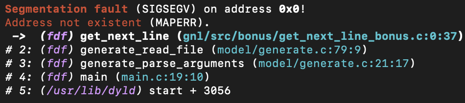
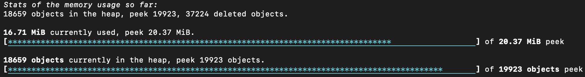
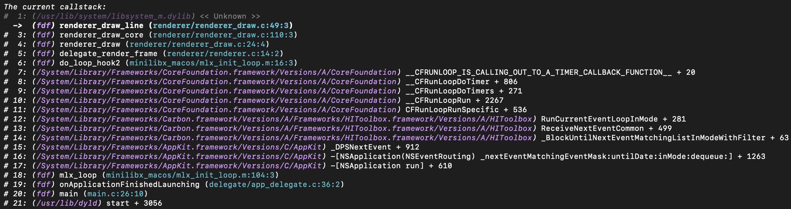

# Signal handlers
The LeakSanitizer catches deadly signals.

## Deadly signals
Upon receipt of a deadly signal, the program is terminated and the callstack of the receiving point is printed.
The faulty address is also printed if available.

> [!TIP]
> **Example**:
> <picture>
>     <source srcset="images/light/segfault.png" media="(prefers-color-scheme: light), (prefers-color-scheme: no-preference)" />
>     <source srcset="images/dark/segfault.png" media="(prefers-color-scheme: dark)" />
>     
> </picture>

### Caught deadly signals
- `SIGSEGV`
- `SIGABRT`
- `SIGTERM`
- `SIGALRM`
- `SIGPIPE`
- `SIGFPE`
- `SIGILL`
- `SIGQUIT`
- `SIGHUP`
- `SIGBUS`
- `SIGXFSZ`
- `SIGXCPU`
- `SIGSYS`
- `SIGVTALRM`
- `SIGPROF`
- `SIGTRAP`

## `SIGUSR1`
`SIGUSR1` causes the current memory statistics to be printed. It shows you the amount of the currently
allocated objects and the amount of the currently allocated bytes as well as their peek values.

These statistics are only available if the statistical bookkeeping is activated by [`LSAN_AUTO_STATS`][1]
or [`LSAN_STATS_ACTIVE`][2].

> [!TIP]
> **Example**:
> <picture>
>     <source srcset="images/light/SIGUSR1.png" media="(prefers-color-scheme: light), (prefers-color-scheme: no-preference)" />
>     <source srcset="images/dark/SIGUSR1.png" media="(prefers-color-scheme: dark)" />
>     
> </picture>

## `SIGUSR2`
`SIGUSR2` causes the stacktrace of the signal handler to be printed.

> [!TIP]
> **Example**:
> <picture>
>     <source srcset="images/light/SIGUSR2.png" media="(prefers-color-scheme: light), (prefers-color-scheme: no-preference)" />
>     <source srcset="images/dark/SIGUSR2.png" media="(prefers-color-scheme: dark)" />
>     
> </picture>

[1]: Behaviour#lsan_auto_stats
[2]: Behaviour#lsan_stats_active